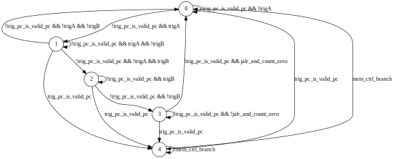

# Problem statement

## Part 1

We discovered some shadowy organization used to deploy malware able to insert hardware trojans in FPGA designs during the synthesis process. Due to reprogramability requisites, some quite important subsystems of the rbs use FPGAs, so if we manage to understand how the designs are modified, we can turn this into our advantage.

We were able to [replicate](https://github.com/rf-hw-team/fpga-zynq) a design using the Rocket RISC-V core on a Zynq-7020 FPGA and found this core got infected by the synthesis tools!

Help us analyzing the compromised CPU core. We suspect the hardware trojan is triggered by writing a particular string to memory. We attached below the netlist of the SoC infected after synthesis. Find and submit the trigger string (it is already in our flag format).

**Files**

 * [with_trojan.v](with_trojan.v)

**Useful info**

 * [Xilinx cells](https://github.com/YosysHQ/yosys/tree/master/techlibs/xilinx)
 * [Interesting paper](https://www.cse.cuhk.edu.hk/~qxu/zhang-dac13.pdf)


## Part 2

After you solved for Part 1, we found a Rocket RISC-V system at `iot.pwn2.win`. We need to own a root shell in this system through SSH. To get this done, it is not enough to know the trigger string. We need to understand how the 64-bit word written just after the trigger string affects the control flow and how this can be employed to compromise the Dropbear server. We are counting on you: get a shell and submit the contents of `/root/flag`.

**Files**

 * [dropbear](dropbear) (originally we gave the entire rootfs, but you only really need the dropbear binary)


# Introduction

Hardware reversing is hard. There is a huge lack of (public) tools. You must be prepared to spend lots of time with manual analysis and to roll your own tooling if needed. Let's get our hands dirty!

## A note about notation

Netlists use a very confusing notation. Many signals are prefixed with `\` and end with mandatory whitespace. That is some kind of escape that allows the name of the net to contain special chars. For instance, `\name[50] ` is not the 51th bit of `name` – it is just a net named `\name[50] `. You can even end up with weird things such as `\name[50] [4]`, which means the 5th bit (from LSB to MSB) of the `\name[50] ` net.


# Locating the trojan

In a more realistic setting, we would probably need something like [VeriTrust](https://www.cse.cuhk.edu.hk/~qxu/zhang-dac13.pdf) or [ANGEL](https://eprint.iacr.org/2017/783.pdf), but neither of these tools seems to be publicly available (if you have a copy, please share!)

However, we are quite lucky, since this challenge's netlist is not obfuscated.

To get a baseline for our work, we can build a [clean version](without_trojan.v) of the SoC by cloning the [project](https://github.com/rf-hw-team/fpga-zynq) and building it in Vivado (I sincerely hope the Vivado binary you download from the Xilinx website does not come with the fictional malware.)

Anyway, you should really take a moment to study the Rocket core and try to think where someone could insert a trojan behaving as described in the problem statement. It must have access to data being written to the data cache. It must also have a means to change control flow.

Well, control flow (and most of the core logic) is implemented in the [RocketCore.scala](https://github.com/rf-hw-team/rocket-chip/blob/master/src/main/scala/rocket/RocketCore.scala) file. Connection with the data cache happens at [line 687](https://github.com/rf-hw-team/rocket-chip/blob/master/src/main/scala/rocket/RocketCore.scala#L687). Let's try to locate this stuff in the netlist.

The netlist code is not so hard to comprehend, as we shall see, but it can be really overwhelming to navigate through it. You should take some notes and draw diagrams to help you locate yourself. Since nets in different modules may have the same or very similar names, a trick that helps a lot is to split different modules into separate files, *e.g.*:

```bash
grep -Pzo '(?s)module Rocket\n.*?endmodule' with_trojan.v > Rocket.v
grep -Pzo '(?s)module RocketTile\n.*?endmodule' with_trojan.v > RocketTile.v
```

The module hierarchy directly around the core is as follows: `[...] → RocketTile → Rocket → {CSRFile, IBuf, MulDiv}`. Most of the code from the RocketCore Chisel module ends up at the [Rocket](Rocket.v) Verilog module, but some code gets scattered to its parent, the [RocketTile](RocketTile.v) module.

Let's look for the data cache (`DCache`) instantiation. The `io.dmem.s1_data.data` net is [here](RocketTile.v#L12454). In the trojaned version, it is called `dcacheArb_io_requestor_1_s1_data_data` and is connected to [Rocket's `\a_data_reg[63] ` input](RocketTile.v#L4417) and to [several LUTs](RocketTile.v#L13938-L14535) involving some mysterious `trig_pc` nets. On the other hand, in the [clean version](without_trojan.v#L288397) it is called `dcache_io_cpu_s1_data_data` and is connected just to [Rocket's `\a_data_reg[63] ` input](without_trojan.v#L287477). So it looks like `trig_pc` is related to the trojan (there isn't anything with a similar name in the clean version).

Let's continue to follow this signal. Inside the Rocket module, `\a_data_reg[63] ` is connected to the output of [several flip-flops](Rocket.v#L17326-L17837) whose inputs come from the `mem_reg_rs20_in` and `mem_reg_rs2` vectors. These also [exist](without_trojan.v#L281307-L281818) in the clean version. But there are lots of new things that didn't exist before the trojan – [here](Rocket.v#L18586-L18643), [here](Rocket.v#L19897-L20106) and [here](Rocket.v#L20674-L20903). These involve some shady `trig_jalr_count` and `trig_state` signals.


# The trigger string

If you were solving the first version of this challenge (from [Pwn2Win CTF 2019](https://pwn2.win/2019/#/challenges)), you would probably have almost retrieved the flag for Part 1 by now. In the previous version, the `\a_data_reg[63] ` signal we have just located would be compared to a pair of 64-bit constants, so you would only need to recover these constants (of course, these would be scattered across several LUTs). This was actually solved by a former member of dcua who is now playing with perfect blue (sorry, I don't remember your nickname, please contact me so that I can update this write-up.) However, things in this version of the challenge are a little different.

So let's continue to analyze how the `\a_data_reg[63] ` signal is used. [This group](Rocket.v#L19897-L20106) and [this other group](Rocket.v#L20674-L20903) of LUTs have a very magical constant as their `.INIT` parameter: `64'h9009000000009009`. To understand why this constant is magical, we need to explain what a LUT is.

## LUTs

LUT is just an abbreviation for *look-up table*. It is just a table on which you can look for the inputs' value and see which output is associated with them. If you studied digital logic, you might have called this a [truth table](https://en.wikipedia.org/wiki/Truth_table).

If you have 6 inputs, you can represent this table as a `2**6` == 64-bit value. Each bit of the value represents the output for a given set of inputs.

We wrote a [small tool](lut.py) that receives the value of the `.INIT` parameter and the desired output (0 or 1), then lists every set of inputs that produces the desired output.

Let's see which inputs produce a true (1) output for our `.INIT(64'h9009000000009009)` LUTs:

```
$ ./lut.py 0x9009000000009009 1
000000
000011
001100
001111
110000
110011
111100
111111
```

So they evaluate to true whenever all neighbor inputs (in pairs) are equal to each other. For example, the following LUT:

```verilog
  LUT6 #(
    .INIT(64'h9009000000009009)) 
    \trig_pc[63]_i_11 
       (.I0(\a_data_reg[63] [59]),
        .I1(_GEN_277[122]),
        .I2(\a_data_reg[63] [58]),
        .I3(_GEN_277[121]),
        .I4(_GEN_277[120]),
        .I5(\a_data_reg[63] [57]),
        .O(\trig_jalr_count_reg[0]_5 [3]));
```

drives `\trig_jalr_count_reg[0]_5 [3]` with the logical value of `\a_data_reg[63] [59] == _GEN_277[122] && \a_data_reg[63] [58] == _GEN_277[121] && _GEN_277[120] == \a_data_reg[63] [57]`.

Wow, this really looks like a 4-bit *equal comparator*.

## Constructing a bigger comparator

To compare more than 4 bits, we would just need to combine the `\trig_jalr_count_reg[0]_5 [i]` (for each i) nets together. These nets are actually outputs of the Rocket module, connected [here](RocketTile.v#L5503) to `{core_n_1485,core_n_1486,core_n_1487,core_n_1488}`, which are combined together using a `CARRY4` cell [here](RocketTile.v#L14671-L14676).

```verilog
  CARRY4 \trig_pc_reg[63]_i_8 
       (.CI(\trig_pc_reg[63]_i_10_n_0 ),
        .CO({\trig_pc_reg[63]_i_8_n_0 ,\trig_pc_reg[63]_i_8_n_1 ,\trig_pc_reg[63]_i_8_n_2 ,\trig_pc_reg[63]_i_8_n_3 }),
        .CYINIT(\<const0> ),
        .DI({\<const0> ,\<const0> ,\<const0> ,\<const0> }),
        .S({core_n_1485,core_n_1486,core_n_1487,core_n_1488}));
```

Of course, you can try to understand what a `CARRY4` does by looking at the [Verilog description of cells](https://github.com/YosysHQ/yosys/blob/a7f2ef6d34c4b336a910b3c6f3d2cc11da8a82b4/techlibs/xilinx/cells_sim.v#L376-L380) provided by the yosys project. However, it is much easier to understand them by reading the [Xilinx documentation](https://www.xilinx.com/support/documentation/user_guides/ug474_7Series_CLB.pdf#page=48). They essentially implement fast carry logic using generate (`DI`) and propagate (`S`) signals. If you never heard about that, you should really [watch this lecture by Professor Arvind](https://youtu.be/VoIxhuhTZbc?t=1813) explaining how it works.

In the case at hand, all generate (`DI`) signals are zero – only the propagate (`S`) signals are used. This means the carry (either from `CI` or from `CYINIT`) is only propagated all the way to the last carry output (MSB of `CO`) if all propagate (`S`) bits are high. So the `CARRY4` cell is essentially being used here as a 4-input AND gate.

So here it is how the 4-bit *equal comparators* are being combined. It all starts at [here](RocketTile.v#L14659), with a `CYINIT` of 1. Then the carry is propagated to other `CARRY4` cells (MSB of `CO` is connected to `CI` of the next cell) until the final result is obtained at the [`trigB` net](RocketTile.v#L14667). An analogous structure exists resulting in the [`trigA` net](RocketTile.v#L14704).

Putting it all together:
 * `trigA` is the result of the comparison `\a_data_reg[63] == {_GEN_277[62:0], \trig_mem_data_reg_n_0_[0] }`.
 * `trigB` is the result of the comparison `\a_data_reg[63] == _GEN_277[126:63]`.

## WTF is `_GEN_277`?

You probably already know the answer – it's the trigger string (*i.e.*, the flag for Part 1). But how is it computed? **At this point, we could say we don't care and just simulate the circuit until some string starting with `CTF-BR{` pops up at `_GEN_277`**.

However, since we are ever curious, we look for [the flip-flops driving these signals](Rocket.v#L18853-L19876). These flip-flops are very interesting because each one has its output `Q` connected to the input `D` of the previous one. Hey, this looks like a *shift register*, shifting bits from MSB to LSB.

But there is a catch! The input for instances `\trig_mem_data_reg[120] `, `\trig_mem_data_reg[125] ` and `\trig_mem_data_reg[126] ` does not come directly from the next flip-flop in line. It comes from [some](Rocket.v#L18704-L18722) `.INIT(4'h6)` LUTs. The truth table of these LUTs should be very familiar to you:

```
$ ./lut.py 6 1
01
10
```

Wow, these are XOR gates! So let's put it all together. As we have seen, `\trig_mem_data_reg_n_0_[0] ` is the LSB of the shift register; other bits can be obtained from the `_GEN_277` vector. The next value of the MSB comes from the previous value of the LSB. The next value of bits at positions 120, 125 and 126 comes from the previous value of their neighbors XORed with the LSB's previous value. This is clearly a [LFSR](https://en.wikipedia.org/wiki/Linear-feedback_shift_register), and with these taps, it's a [maximal-length 128-bit LFSR](https://www.ijarset.com/upload/2016/february/12_IJARSET_swetha.pdf).

We could go further on and investigate [net `_T_1927`](Rocket.v#L18730), the enable signal of the LFSR (*i.e.*, the LFSR only runs if that signal is high). We won't detail it, but it is essentially another *equal comparator* which checks whether the LSBs of `_GEN_277` are different from `CTF-BR{` (in little-endian).

This is enough to [write a script](lsfr.py) to collect the initial value of the flip-flops from the netlist and run the LFSR until we obtain the flag.

```
$ ./lfsr.py
tap at 120: \trig_mem_data[120]_i_1_n_0
tap at 125: \trig_mem_data[125]_i_1_n_0
tap at 126: \trig_mem_data[126]_i_1_n_0
tap at 127: \trig_mem_data_reg_n_0_[0]
initial value: 0x5adf01e748ef22e547ce8210c60e48ff
polynomial: 0xe1000000000000000000000000000000
flag: CTF-BR{G1.d%fXN}
```


# Changing the control flow

As we say in Portuguese, now the pig twists the tail. So we will only comment on the jump of the cat (meaning we won't detail every boolean algebra manipulation.)

We [already](#locating-the-trojan) located some maliciously-looking `trig_jalr_count` and `trig_pc` registers. The problem statement hinted that the word just after the trigger sequence can affect the control flow and, in fact, these registers can be controlled by a word written to the data cache. The main issue is that the logic is now much harder to understand because different inputs will feed the registers depending on the current state of a state machine.

## The state machine

The current state of the trojan state machine is encoded in a [3-bit register](r/Rocket.v#L20904-L20927). The initial state is zero. Current state is given by `{\trig_state_reg[1]_1 , \trig_state_reg[1]_0 , \trig_state_reg[0]_0 }`, and next state is given by `{mem_ctrl_branch_reg_0, \trig_state[1]_i_1_n_0 , \trig_state[0]_i_1_n_0 }`. This is a hell of similarly named nets, so the first thing we do is to rename these to `{curr_state_2, curr_state_1, curr_state_0}` and `{next_state_2, next_state_1, next_state_0}`, respectively. (It starts to feel like we lost our IDA Pro license and are being forced to use objdump + text editor.)

We now analyze the combinational logic that computes the next state of the FSM, trying to make sense of each intermediary net:

 * [`\trig_state[0]_i_4_n_0 `](Rocket.v#L20657-L20663) → [`curr_state_is_zero`](r/Rocket.v#L20657-L20663): `curr_state == 0`.
 * [`\trig_pc_reg[0]_1 `](Rocket.v#L10997-L11006) → [`jalr_and_count_zero`](r/Rocket.v#L10997-L11006): `mem_ctrl_jalr && trig_jalr_count == 0`.
 * [`\trig_pc_reg[0]_0 `](Rocket.v#L20625) → [`trig_pc_valid_curr`](r/Rocket.v#L20625): current value of `trig_pc_valid` register.
 * [`\trig_pc_reg[63]_0 `](Rocket.v#L20107-L20618) → [`trig_pc_curr`](r/Rocket.v#L20107-L20618): current value of `trig_pc` register.
 * [`\trig_pc_reg[63]_1 ` *aka* `_T_1944`](RocketTile.v#L7358-L7363) → [`trig_pc_is_pc`](r/RocketTile.v#L7358-L7363): `trig_pc_curr` is equal to the current value of the `mem_reg_pc` register.
 * [`\trig_state_reg[1]_2 `](Rocket.v#L12789-L12794) → [`trig_pc_is_valid_pc`](r/Rocket.v#L12789-L12794): `trig_pc_valid_curr && trig_pc_is_pc`.
 * [`\trig_mem_data_reg[63]_0 `](RocketTile.v#L5507) → [`trigA`](r/RocketTile.v#L5507): word written to data cache [matches](#constructing-a-bigger-comparator) first 64 bits of the trigger sequence.
 * [`\trig_mem_data_reg[127]_0 `](RocketTile.v#L5507) → [`trigB`](r/RocketTile.v#L5507): word written to data cache [matches](#constructing-a-bigger-comparator) last 64 bits of the trigger sequence.
 * [`trig_state`](Rocket.v#L20647-L20656) → [`big_expr_01`](r/Rocket.v#L20647-L20656): It helps if you write a different boolean expression for each state:
   ```
   !trig_pc_is_valid_pc && (
        (curr_state == 0) ? (1) :
        (curr_state == 1) ? (trigA) :
        (curr_state == 2) ? (!trigB) :
        0)
   ```
 * [`trig_pc_valid_reg_2` *aka* `core__266_n_0`](RocketTile.v#L7348-L7357) → [`pc_or_jalr_or_not3`](r/RocketTile.v#L7348-L7357): Here it is easier to look for the conditions for it to be false: `!(!trig_pc_is_valid_pc && !jalr_and_count_zero && state==3)` == `trig_pc_is_valid_pc || jalr_and_count_zero || state != 3`.
 * [`\trig_state[0]_i_2_n_0 `](Rocket.v#L20637-L20646) → [`big_expr_02`](r/Rocket.v#L20637-L20646):
   ```
   (curr_state == 0) ? (trigA) :
   (curr_state == 1) ? (1) :
   (curr_state == 2) ? (1) :
   (curr_state == 3) ? (pc_or_jalr_or_not3) :
   (curr_state == 4) ? (pc_or_jalr_or_not3 && mem_ctrl_branch) :
   0
   ```
 * [`\trig_state[1]_i_4_n_0 `](Rocket.v#L20864-L20873) → [`big_expr_03`](r/Rocket.v#L20864-L20873):
   ```
   (curr_state == 1) ? (1) :
   (curr_state == 2) ? (1) :
   (curr_state == 3) ? (jalr_and_count_zero || trig_pc_is_valid_pc) :
   (curr_state == 4) ? (mem_ctrl_branch) :
   0
   ```
 * [`\trig_state[1]_i_2_n_0 `](Rocket.v#L20754-L20763) → [`big_expr_04`](r/Rocket.v#L20754-L20763):
   ```
   (curr_state == 1) ? (big_expr_03 && trigB && !trig_pc_is_valid_pc) :
   (curr_state == 2) ? (!big_expr_03 || !trig_pc_is_valid_pc) :
   (curr_state == 3) ? (!big_expr_03) :
   (curr_state == 6) ? (!big_expr_03) :
   (curr_state == 7) ? (!big_expr_03) :
   0
   ```
 * [`\trig_state[0]_i_1_n_0 `](Rocket.v#L20627-L20636) → [`next_state_0`](r/Rocket.v#L20627-L20636):
   ```
   !target_reset && (!trig_pc_is_valid_pc || !curr_state_is_zero) &&
       (big_expr_01 ? ( big_expr_02 || curr_state_0) :
                      (!big_expr_02 && curr_state_0)))
   ```
 * [`\trig_state[1]_i_1_n_0 `](Rocket.v#L20664-L20673) → [`next_state_1`](r/Rocket.v#L20664-L20673):
   ```
   !target_reset && big_expr_04 && (
       (state == 0 || state == 1) ? (!trig_pc_is_valid_pc && !trigA) :
       1)
   ```
 * [`mem_ctrl_branch_reg_0` *aka* `core__710_n_0`](RocketTile.v#L11635-L11643) → [`next_state_2`](r/RocketTile.v#L11635-L11643):
   ```
   (curr_state == 0) ? trig_pc_is_valid_pc :
   (curr_state == 1) ? trig_pc_is_valid_pc :
   (curr_state == 2) ? trig_pc_is_valid_pc :
   (curr_state == 3) ? trig_pc_is_valid_pc :
   (curr_state == 4) ? !mem_ctrl_branch :
   1
   ```
   please note `target_reset` is handled [directly at the flip-flop](r/Rocket.v#L20927) in this case.

Now we replace `curr_state` the expressions above to map the conditions for every possible state transition. We will omit `target_reset` since it is already clear it resets the state to zero no matter what.

 * `curr_state = 0`:
   * `big_expr_01 = !trig_pc_is_valid_pc`
   * `big_expr_02 = trigA`
   * `big_expr_03 = 0`
   * `big_expr_04 = 0`
   * `next_state_0 = !trig_pc_is_valid_pc && trigA`
   * `next_state_1 = 0`
   * `next_state_2 = trig_pc_is_valid_pc`
   * Possible transitions:
     * `0 -> 0` if `!trig_pc_is_valid_pc && !trigA`
     * `0 -> 1` if `!trig_pc_is_valid_pc && trigA`
     * `0 -> 4` if `trig_pc_is_valid_pc`
 * `curr_state = 1`:
   * `big_expr_01 = !trig_pc_is_valid_pc && trigA`
   * `big_expr_02 = 1`
   * `big_expr_03 = 1`
   * `big_expr_04 = !trig_pc_is_valid_pc && trigB`
   * `next_state_0 = !trig_pc_is_valid_pc && trigA`
   * `next_state_1 = !trig_pc_is_valid_pc && trigB && !trigA`
   * `next_state_2 = trig_pc_is_valid_pc`
   * Possible transitions:
     * `1 -> 0`: `!trig_pc_is_valid_pc && !trigA && !trigB`
     * `1 -> 1`: `!trig_pc_is_valid_pc && trigA && !trigB`
     * `1 -> 2`: `!trig_pc_is_valid_pc && !trigA && trigB`
     * `1 -> 4`: `trig_pc_is_valid_pc`
 * `curr_state = 2`:
   * `big_expr_01 = !trig_pc_is_valid_pc && !trigB`
   * `big_expr_02 = 1`
   * `big_expr_03 = 1`
   * `big_expr_04 = !trig_pc_is_valid_pc`
   * `next_state_0 = !trig_pc_is_valid_pc && !trigB`
   * `next_state_1 = !trig_pc_is_valid_pc`
   * `next_state_2 = trig_pc_is_valid_pc`
   * Possible transitions:
     * `2 -> 2`: `!trig_pc_is_valid_pc && trigB`
     * `2 -> 3`: `!trig_pc_is_valid_pc && !trigB`
     * `2 -> 4`: `trig_pc_is_valid_pc`
 * `curr_state = 3`:
   * `big_expr_01 = 0`
   * `big_expr_02 = jalr_and_count_zero || trig_pc_is_valid_pc`
   * `big_expr_03 = jalr_and_count_zero || trig_pc_is_valid_pc`
   * `big_expr_04 = !jalr_and_count_zero && !trig_pc_is_valid_pc`
   * `next_state_0 = !jalr_and_count_zero && !trig_pc_is_valid_pc`
   * `next_state_1 = !jalr_and_count_zero && !trig_pc_is_valid_pc`
   * `next_state_2 = trig_pc_is_valid_pc`
   * Possible transitions:
     * `3 -> 0`: `!trig_pc_is_valid_pc && jalr_and_count_zero`
     * `3 -> 3`: `!trig_pc_is_valid_pc && !jalr_and_count_zero`
     * `3 -> 4`: `trig_pc_is_valid_pc`
 * `curr_state = 4`:
   * `big_expr_01 = 0`
   * `big_expr_02 = mem_ctrl_branch`
   * `big_expr_03 = mem_ctrl_branch`
   * `big_expr_04 = 0`
   * `next_state_0 = 0`
   * `next_state_1 = 0`
   * `next_state_2 = !mem_ctrl_branch`
   * Possible transitions:
     * `4 -> 0`: `mem_ctrl_branch`
     * `4 -> 4`: `!mem_ctrl_branch`




Therefore, the FSM has 5 states. As [we might already expect](#constructing-a-bigger-comparator), the transitions `0 -> 1` and `1 -> 2` occur when we write the words comprising the trigger sequence. Transition `2 -> 3` occurs when `trigB` turns to false, *i.e.*, when someone writes something different from the second word of the trigger sequence. Therefore, this should be the moment when the attacker provides instructions as to how the control flow should be modified. Transition `3 -> 0` occurs when we run a `jalr` instruction (`mem_ctrl_jalr` signal) and the `trig_jalr_count` register reaches zero. Transition `any -> 4` occurs when the program counter reaches `trig_pc` and `trig_pc_valid` is true. Transitions `4 -> 0` occurs when we run a branch instruction (`mem_ctrl_branch` signal).


## Trojan registers

 * [trig_jalr_count](r/Rocket.v#L18663-L18702) is a 4-bit register whose inputs [are fed](r/Rocket.v#L18586-L18623) with `\a_data_reg[63] [3:0]` whenever `curr_state == 2`, otherwise it gets its current value subtracted by one. The register [is enabled](r/Rocket.v#L18624-L18633) (*i.e.*, is updated with its input) whenever:
   ```
   !trig_pc_is_valid_pc && (
       (curr_state == 3) ? (mem_ctrl_jalr && trig_jalr_count != 0) :
       (curr_state == 2) ? (!trigB) :
       0)
   ```

 * [trig_pc_valid](r/Rocket.v#L20619-L20626) is a flip-flop that is always [updated with](r/RocketTile.v#L8756-L8762) the logical value of `(curr_state == 3 && jalr_and_count_zero) || (trig_pc_valid_curr && !mem_ctrl_branch)`.

 * [trig_pc](r/Rocket.v#L20107-L20618) is a 64-bit register. The logic driving its inputs is a little complicated. First, [several LUTs](r/RocketTile.v#L6788-L7339) drive the `core__..._n_0` nets with the current value of `trig_pc` if `curr_state != 2`, otherwise they drive these nets with zero. Then, [another group of several LUTs](r/RocketTile.v#L13930-L14279) drives each of the `\trig_pc[...]_... ` nets with a given bit of `dcacheArb_io_requestor_1_s1_data_data` (*aka* `\a_data_reg[63] `) if `curr_state == 2`, otherwise they implement part of the logic of an adder to sum `mem_reg_pc` to the current value of the register (the other part of the adder is implemented by some [`CARRY4` cells](r/RocketTile.v#L14592-L14652)). The register [is enabled](r/Rocket.v#L19887-L19896) when:
   ```
   (curr_state == 2) ? (!trigB && !trig_pc_is_valid_pc) :
   (curr_state == 3) ? (jalr_and_count_zero) :
   0
   ```
   However, you may notice not all bits of `dcacheArb_io_requestor_1_s1_data_data` (let's call it `word`, for simplicity) end being used in `trig_pc`. You may run [this script](trig_pc.py) to realize that (when `curr_state == 2`) `trig_pc` gets updated with `{{4{word[52]}}, word[60:56], word[52:48], word[44:40], word[36:32], word[28:24], word[20:16], word[12:8]}`. Our reason (as the creators of the trojan) to ignore some bits was to allow the string to be completely printable (for your convenience).

   You may find it funny the MSBs are being set to `word[52]`. It was actually a [mistake](rocket-chip.diff#L63) we made when changing the logic so that it would not be identical to the challenge from [Pwn2Win CTF 2019](https://pwn2.win/2019/#/challenges). It would make more sense if we were setting the MSBs to `word[60]` (so that we would be sign-extending the value). This little mistake will not hinder us from exploiting Dropbear, which is the goal of this challenge. But beware if you want to deploy this trojan in production!


## Putting it all together

 * We write `CTF-BR{G1.d%fXN}` to memory.
 * Next, we write to memory a word containing the desired values of `trig_jalr_count` and `trig_pc`.
 * When the processor executes a `jalr` instruction (*e.g.* return from function), `trig_jalr_count` is decremented.
 * When `trig_jalr_count` reaches zero, `trig_pc` is added to the current PC and `trig_pc_valid` is set to true.
 * When the processor arrives at `trig_pc`, it starts waiting for a branch instruction.
 * When the processor arrives at a branch instruction, it [inverts its condition](r/Rocket.v#L10918-L10927).
 * The trojan goes back to its idle state.


# Exploiting Dropbear

If we study Dropbear's source code, we will realize the password is copied at the [`buf_getstring` function](https://github.com/mkj/dropbear/blob/b4bd23b4d2a4c640880b49069e02cd598dd03416/buffer.c#L223). If we provide the trigger sequence as a password, this causes the trojan to activate inside the `memcpy` function. However, it is not practical to set `trig_pc` at the first `jalr` since we don't know where the libc is located in memory. Therefore, we wait for one more `jalr` instruction so that we can catch the PC when returning from the `buf_incrpos` function called [just after](https://github.com/mkj/dropbear/blob/b4bd23b4d2a4c640880b49069e02cd598dd03416/buffer.c#L224) `memcpy`. That `jalr` instruction is located at [`0x143bc`](dropbear.txt#L1495).

Then, we can target the [`constant_time_memcmp` function](https://github.com/mkj/dropbear/blob/02ffdd09dc1941f7a924cde8db288fcd64987f59/dbutil.c#L596) at [`0x1f7d0`](dropbear.txt#L13020), which is used to [check passwords](https://github.com/mkj/dropbear/blob/8b4f60a7a113f4e9ae801dea88606f2663728f03/svr-authpasswd.c#L46), forcing the branch at [`0x1f7dc`](dropbear.txt#L13023) to flip its condition and causing the function to return zero even if the strings are different.

To get this exploit going, we need to set:
 * `trig_jalr_count` to 2.
 * `trig_pc` to `0x1f7d0 - 0x143bc` = `46100`.

We have written [a script](solver.py) to construct the payload and connect to the board using SSH. After running it, we get the flag:

```
$ ./solver.py
[+] Connecting to iot.pwn2.win on port 22: Done
[!] Couldn't check security settings on 'iot.pwn2.win'
[+] Opening new channel: 'cat /root/flag': Done
[+] Receiving all data: Done (78B)
[*] Closed SSH channel with iot.pwn2.win
[*] exit code: 0
[*] flag: b'CTF-BR{WhY_D0_p30pl3_3v3N_w0RRy_4b0U7_7h31R_P4s5W0rD/jUs7_U5E_7H3_M4s7eR_kEy}\n'
```


# Suggestions for future work

[HAL](https://github.com/emsec/hal) is a very promising tool that would have made this challenge much more tractable since it allows you to visualize and navigate more easily through the netlist. We actually tried to solve this challenge using HAL but had several issues. First of all, HAL does not support the syntax for renaming ports in the module port list (but hey, lots of tools also lack support for that syntax). After fixing that, we had problems with `CARRY4` and other cells that have multi-bit ports, so we gave up. If you get around these issues, please publish a write-up. We would be very interested in seeing alternate solutions to this challenge.

A tool to automatically analyze FSMs would also have helped a lot. The HAL developers [have proposed some algorithms](https://tches.iacr.org/index.php/TCHES/article/view/7277/6455), but they are not implemented as a HAL plugin yet. Yosys is able to extract FSMs [from RTL designs](https://stackoverflow.com/a/32648163/13649511), but [not from netlists](https://stackoverflow.com/a/61632757/13649511). Maybe [yosys-smtbmc](http://zipcpu.com/blog/2017/10/19/formal-intro.html) could help. If you manage to automate the [FSM analysis](#the-state-machine), please write about it and share it with us.


# Where can I learn more?

Below we suggest write-ups for other hardware challenges. We hope these are useful for those willing to study more about this subject.

 * Pwn2Win 2016: Timekeeper's Lock [official write-up](https://github.com/epicleet/write-ups-2016/blob/master/pwn2win-ctf-2016/reverse/timekeeperslock-600/README.md).
 * Pwn2Win 2017: Shift Register [write-up by q3k](https://blog.dragonsector.pl/2017/10/pwn2win-2017-shift-register.html). 
 * CODEBLUE CTF 2018 Quals: watch_cats [write-up by q3k](https://blog.dragonsector.pl/2018/08/code-blue-ctf-2018-quals-watchcats.html) (not a hardware challenge, but q3k transformed it into one to use the yosys SMT solver).


# Challenge source code

 * [rocket-chip.diff](rocket-chip.diff): to be applied over the [rocket-chip](https://github.com/rf-hw-team/rocket-chip) repository.
